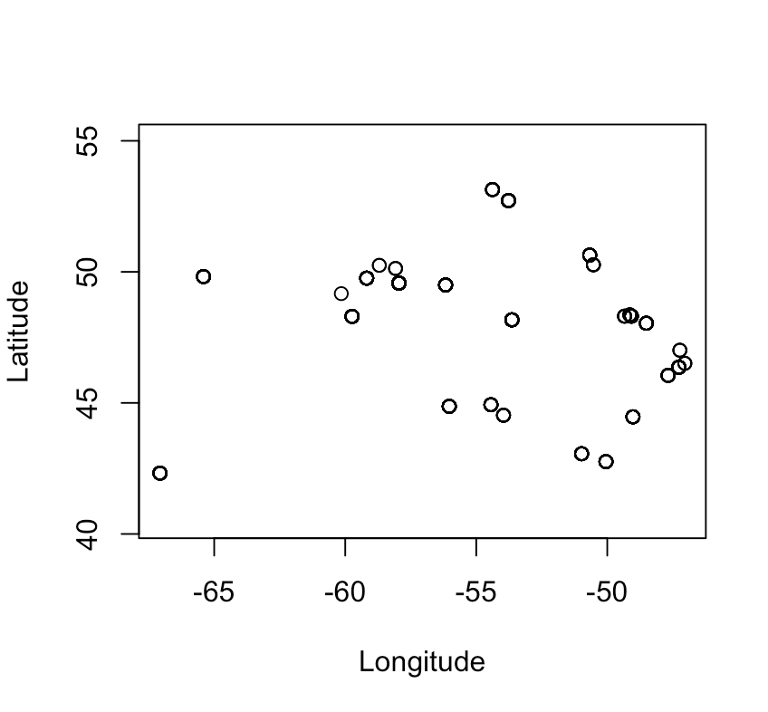
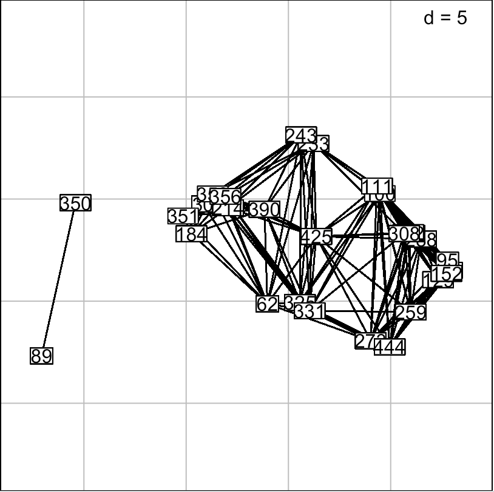
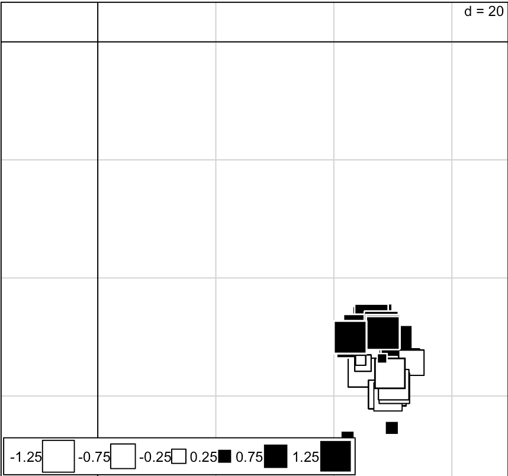
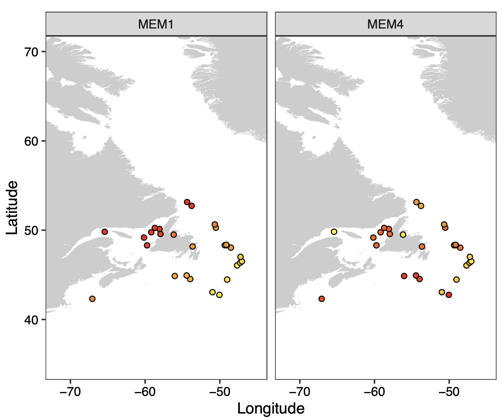

_______________________________________________________________________________

#### Laura Benestan

Montpellier 3 April 2020

_______________________________________________________________________________

# Moran's Eigenvector Maps (MEMs)

Moran's eigenvectors maps (MEM) are complete and easy-to-use mathematical objects that aims to partition the spatial distribution across samples.

### Softwares

- [R Version 3.6.0](https://cran.r-project.org/)
	* R packages: codep, adespatial, adegraphics, vegan, car, dplyr, data.table
ggplot2, sf, tidyr

## 1. Create Moran Eigenvector's Maps (MEMs) to be the spatial variables

Prepare a file containing in each column:
1. the individual labels
2. the latitude 
3. longitude information.

Download this file in your R environment.

```{r}
geo <- read.table("geographic_coordinates_fasciatus.txt",header=TRUE)
```

Keep latitude and longitude in this order as for the function `gcd.hf`, latitude needs to be first. 
```{r}
Coor=geo[,2:3]
Coorxy=geo,3:2]
```

Look the spatial distribution 
```{r}
plot(Coor, asp=1)
```



Compute spatial distances among sites accounting for the earth curvature.
```{r}
DistSpatial=gcd.hf(Coor) 
```

**Compute MEM** by keeping default setting for truncation (length of the longest edge of the minimum spanning tree will be used as the threshold) and just positive MEM.
```{r}
dbmem = dbmem(DistSpatial)
```

Look at general output, we get 12 MEMs.
```{r}
summary(dbmem)
```

Specify where to find the function to be sure of the function version to use in the package `adegraphics`.
```{r}
adegraphics::s.label(Coor, nb = attr(dbmem, "listw"))
```



Visualising the 12 MEMs by using the Coorxy object. 
The 1rst MEMs represent large spatial scales while the last MEMs are small spatial scales. 
MEMs can be used in stats like any other environmental variables.
```{r}
ade4::s.value(Coorxy, dbmem[,1])
```


To learn more about MEMs, see the elegant vignette of [Stéphane Dray](https://cran.r-project.org/web/packages/adespatial/vignettes/tutorial.html)

## 2. Visualize the MEM values

Open the file containing the MEM values (that you have previously saved).
```{r}
dbmem <- read.table("DbMEM-GPS-444ind.txt", header=TRUE)
```

Change from wide to long format in order to be able to use `ggplot2`package on your dataset.
```{r}
dbmem_gps_long <- gather(dbmem, MEM, Value, MEM1:ncol(dbmem))
```

Calculate an MEM average value for each GPS point.
```{r}
dbmem_gps <- dbmem_gps_long %>% group_by(Latitude, Longitude, MEM)%>%
  summarise(mem_mean <- mean(Value))
setnames(dbmem_gps, "mem_mean <- mean(Value)", "Average_MEM")
dbmem_wide <- spread(dbmem_gps, MEM, Average_MEM)
write.table(dbmem_wide, "Mean_MEM_28GPS_fasciatus.txt", quote=FALSE, sep="\t",row.names=FALSE)
```

## 3. Create a map with `sf` package
```{r}
wH <- map_data("worldHires",  xlim=c(-100,100), ylim=c(20,100)) # subset polygons 
```

First create the map background without adding any sampling point. 
```{r}
ggplot() +
  geom_polygon(data = wH, aes(x=long, y = lat, group = group), fill = "gray80", color = NA) +
  coord_fixed(xlim=c(-100,100), ylim=c(20,100), ratio = 1.3) +
  theme(panel.background = element_rect(fill = "white", colour = "black"),
        axis.title = element_blank())
```

Select only MEM1 and MEM3.
```{r}
dbmem_gps_long_mem14 <- subset(dbmem_gps, subset=MEM=="MEM1"| MEM=="MEM4")
```

## 4. Create a ggmap for each MEMs

Create a map showing only the MEM 1 and MEM4 (that were found to be teh most significant spatial factors in our case).
```{r}
pdf("MEM1_4_fas.pdf", width=5, height=5)
x_title="Longitude"
y_title="Latitude"
graph1 <- ggplot() +
  geom_polygon(data = wH, aes(x=long, y = lat, group = group), fill = "gray80", color = NA) +
  coord_fixed(xlim = c(-72,-45), ylim=c(35,70), ratio=1.2)+
  facet_wrap(~MEM)+
  theme(panel.background = element_rect(fill = "white", colour = "black"),
        axis.title = element_blank())+
  geom_point(aes(x = Longitude, y = Latitude,fill=Average_MEM), data=dbmem_gps_long_mem14,shape = 21, size=1.5)+
  theme_bw()+theme(legend.position = "none",
                   panel.grid.major = element_blank(), panel.grid.minor = element_blank())+
  labs(y=y_title)+  
  labs(x=x_title)+
  theme(axis.text.x=element_text(colour="black"))+
  theme(axis.text.y=element_text(colour="black"))+
  scale_fill_continuous(high="yellow",low="red")
graph1
dev.off()
```


